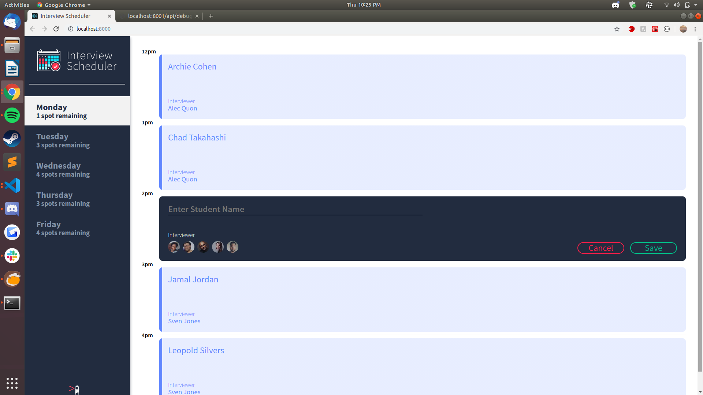
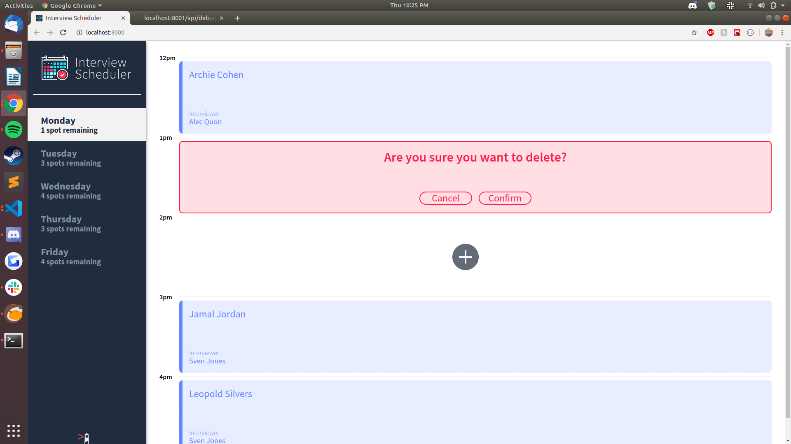

# Interview Scheduler

## Setup

A single-page React app that allows the user to book / cancel / edit interviews. Must be run in conjunction with the [Scheduler-API server](https://github.com/rickychhoukdean/scheduler-api). Install dependencies with `npm install`.

## Running Webpack Development Server

```sh
npm start
```

## Running Jest Test Framework

```sh
npm test
```

## Running Storybook Visual Testbed

```sh
npm run storybook
```

## Screenshots



